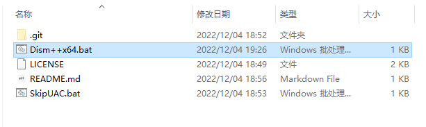
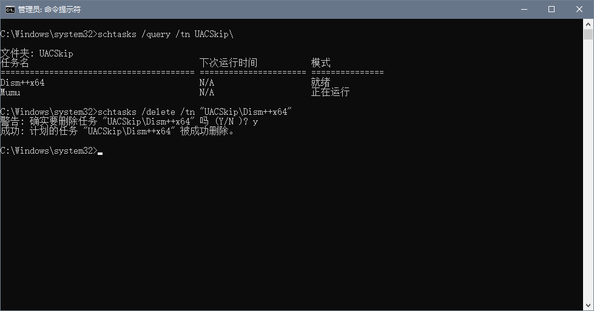

# WindowsUACSkipper

## 简介

通过对指定程序进行一次`UAC授权`并生成`快捷启动方式`，后续使用该`快捷启动方式`启动时，无需再次进行`UAC授权`也可`以管理员权限运行`

## 使用说明

将想要跳过UAC的程序执行文件拖放到`SkipUAC.bat`文件上

执行完成后会在`SkipUAC.bat`所在目录输出与拖放进来的程序同名的批处理文件，使用该批处理文件即可免`UAC授权`并`以管理员权限运行`程序

## 注意事项

- 不支持路径中带有空格的程序
- 支持Windows10 1809 以上版本，Windows10 1809 以下版本兼容性未知
- 需要cmd环境中有PowerShell以及Schtasks指令

## 如何删除授权(TODO)

1. 在cmd中执行`schtasks /query /tn UACSkip\` 指令，即可查看所有已授权程序
2. 以在管理员权限的cmd中执行`schtasks /delete /tn "UACSkip\<name>"` 指令，即可删除对程序的授权，这里的<name>需要替换为你想要删除的程序的名称

