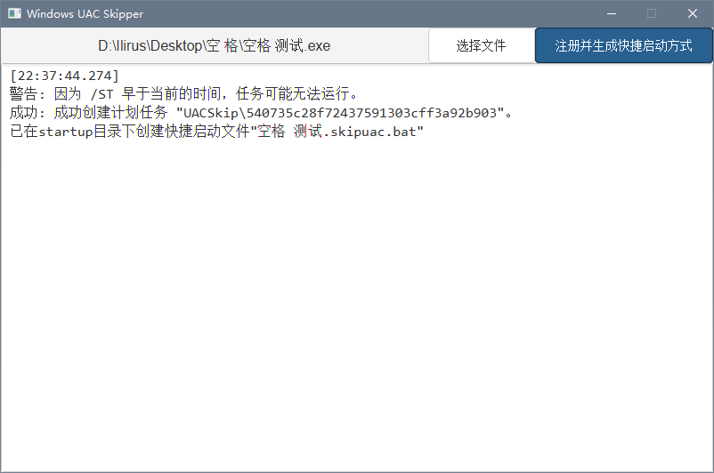

# WindowsUACSkipper

## 简介

通过对指定程序进行一次`UAC授权`并生成`快捷启动方式`，后续使用该`快捷启动方式`启动时，无需再次进行`UAC授权`也可`以管理员权限运行`该程序

## 使用说明

授权完成后会在程序所在目录的下的`startup`目录中创建免UAC启动方式，使用该文件即可以`管理员权限`启动程序

## 注意事项

- 已测试支持中文路径以及带空格路径，但是路径中若有特殊符号仍可能导致无法授权
- 支持Windows10 1809 以上版本，Windows10 1809 以下版本兼容性未知
- 需要系统有Schtasks组件，正常情况下都有，精简版之类的系统若没有该组件则无法使用
